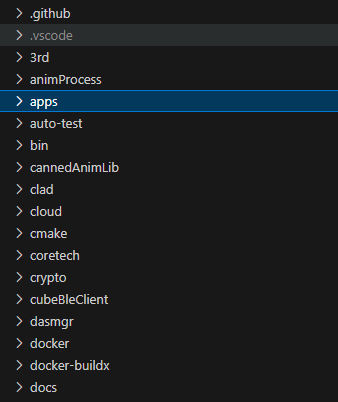

# Setting up your dev enviroment

This guide aims to walk you through setting up a [Victor](https://github.com/kercre123/victor) dev enviroment from scratch.
If you encounter issues while following this guide, head over to the [V&F discord](https://discord.gg/k5y7k7p93T) and ping ThommoMC

## Installing needed programs

This step will handle downloading and configuring your IDE (Integrated Development Enviroment) for Victor

1. Download VSCode from [here](https://code.visualstudio.com/download) for your platform.
2. Download git from [here](https://git-scm.com/downloads) for your platform.
3. LINUX AND WINDOWS ONLY: Download docker from [here](https://www.docker.com/get-started/) for your platform.
4. Run each installer, if it prompts you to make a selection just leave it at the defaults for now.

## Getting and Opening the source

This step will walk you through getting and opening the source code using git and VSCode

1. Open up a terminal and run the following commands:

```
git clone --recurse-submodules https://github.com/kercre123/victor -b snowboy
cd victor
git lfs install
git lfs pull
```
- Open VSCode, then do File>Open Folder and choose victor

You should now see something like this on the left side of your screen, keep in mind this is a small section of it so if you have more files don't panic! If you don't have any of these files make sure you have opened the right folder.


## Building Victor
This step is where things start to change depending on what platform your on. Don't worry though, its still pretty easy! Just follow the steps for your platform below.

#### Linux
Just open up a terminal and run `./wire/build-d.sh` and let its do its thing. Once it has finished building, get your robots ip and run `echo replace_with_robots_ip > robot_ip.txt`, then copy your robots ssh key to a file called `robot_sshkey` in the root of the repo and then finally run `./wire/deploy-d.sh` to deploy your freshly built victor!

#### Windows
